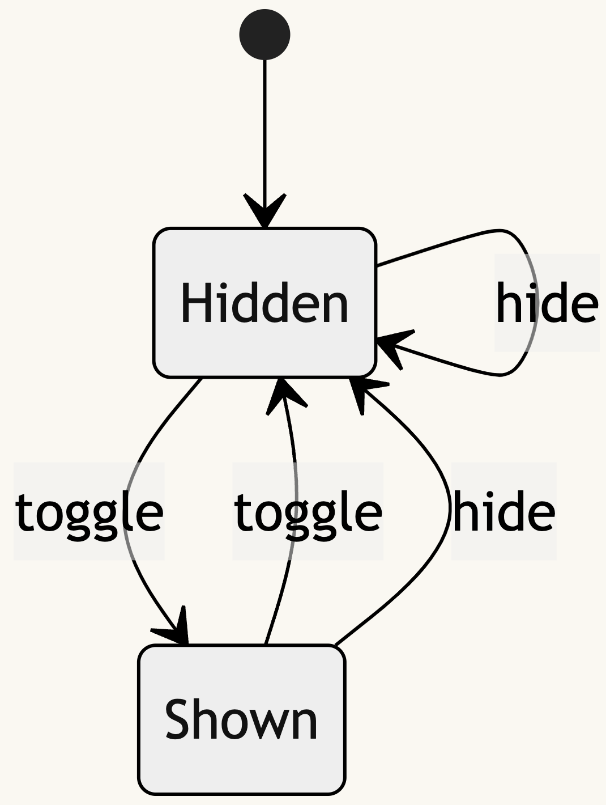

# rxjs-fsm


This package provides a set of tools for utilizing complete deterministic finite automata (Finite state machine) in RxJS with a focus on functional programming.
Allowing developers to efficiently manage complex state machines in context of reactive programming.

✅ &nbsp;Tree Shakeable (ES modules)  
✅ &nbsp;Fully Typed  
✅ &nbsp;Unit Tests  
✅ &nbsp;Documentation


## Installation

```sh
npm i @jkba/rxjs-fsm
```


## Example Usage

Let's consider the following use-case as an example. It is discussed in detail in a dedicated [blog post](https://blog.jakb.cz/posts/automata-in-rxjs/).



In the very first step, let's represent this automata:

```ts
export type Input = 'toggle' | 'hide';
export type State = 'hidden' | 'shown';

export const transitions: StateTransitions<State, Input> = {
  hidden: {
    toggle: 'shown',
    hide: 'hidden',
  },
  shown: {
    toggle: 'hidden',
    hide: 'hidden',
  },
};
```


Suppose we represent inputs as Observables and the initial state as a constant:

```ts
const toggle$ = new Subject<void>();
const hide$ = new Subject<void>();

const initialState: State = 'hidden';
```

It is necessary to create a single input Observable and _mark_ individual values in order to retain proper types. For this purpose, let's use `fsmHelpersFactory` function.

```ts
const { markInput } = fsmHelpersFactory<State, Input>(transitions);

const input$ = merge(
  toggle$.pipe(markInput('toggle')),
  hide$.pipe(markInput('hide')),
);
```

Finally, we can create the machine object:

```ts
const machine = rxjsFsmFactory(transitions, input$, initialState);
```

Listen to the current state:

```ts
machine.selectState().subscribe(console.log);

// Emits only on `hidden` state
machine.selectState('hidden').subscribe(console.log);
```

### Minimalistic

Another approach is to avoid the _machine_ object and use this library in a pipe with an existing Observable:

```ts
const {
  fsm,
  markInput,
} = fsmHelpersFactory<State, Input>(transitions);

const state$ = input$.pipe(fsm(initialState));

state$.subscribe(console.log);
```


## Build

Use `npm link` and then `npm link @jkba/rxjs-fsm` in your project.


## Release

Use `npm version`, don't forget to push the tag and the CI will take care of the rest.


## License

This project is licensed under [MIT License](http://opensource.org/licenses/MIT/).
For the full text of the license, see the [LICENSE](LICENSE) file.
